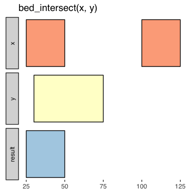
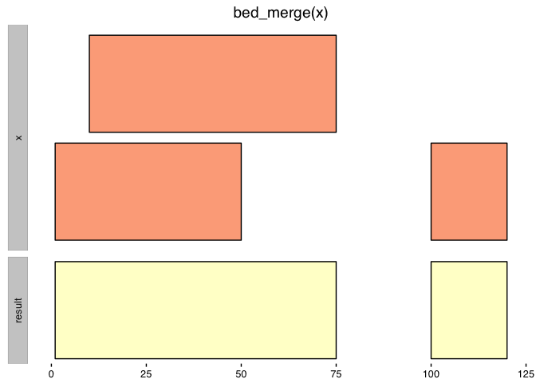
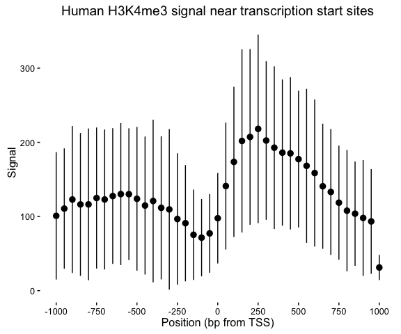
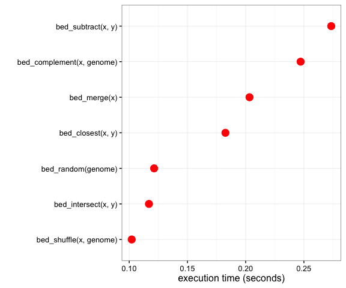

valr
====


[](https://travis-ci.org/jayhesselberth/valr) [](https://ci.appveyor.com/project/jayhesselberth/valr) [](https://codecov.io/github/jayhesselberth/valr?branch=master) [](http://www.r-pkg.org/pkg/valr)

`valr` provides tools to read and manipulate genome intervals and signals, similar to the standalone [`BEDtools`](http://bedtools.readthedocs.org/en/latest/) suite. `valr` enables BEDtools-like analysis in the R/RStudio environment, and uses modern R tools for a terse, expressive syntax. Compute-intensive algorithms are implemented in [`Rcpp`](http://bedops.readthedocs.org/en/latest/index.html)/C++, and many methods take advantage of the speed and grouping capability provided by [`dplyr`](http://www.rcpp.org/).

Installation
------------

`valr` can be installed from github, and will be eventually deposited in CRAN.

``` r
# install.packages("devtools")
devtools::install_github('jayhesselberth/valr')
```

Why `valr`?
-----------

**Why another tool set for interval manipulations?** There are several [other software packages](#related_work) available for genome interval analysis. However, based on our experiences teaching genome analysis, we were motivated to develop a toolset that:

-   Combines analysis and visualization in RStudio.
-   Can be used to generate reports with Rmarkdown.
-   Is highly extensible. New tools are quickly implemented on the R side.
-   Leverages the "modern R" syntax, using `dplyr` and the pipe operator from `magrittr` (`%>%`).
-   Maximizes speed by implementing compute-intensive algorithms in `Rcpp`.
-   Facilitates interactive visulaizations with [`shiny`](http://rmarkdown.rstudio.com/).

`valr` can currently be used for analysis of pre-processed data in BED and related formats. We plan to support BAM and VCF files soon via tabix indexes.

### Familiar tools, all within R

The functions in `valr` have similar names to their `BEDtools` counterparts, and so will be familiar to users coming from the `BEDtools` suite. Similar to [`pybedtools`](https://daler.github.io/pybedtools/#why-pybedtools), `valr` has a terse syntax:

``` r
library(valr)
library(dplyr)

snps <- read_bed(valr_example('hg19.snps147.chr22.bed.gz'), n_fields = 6)
genes <- read_bed(valr_example('genes.hg19.chr22.bed.gz'), n_fields = 6)

# find snps in intergenic regions
intergenic <- bed_subtract(snps, genes)
# distance from intergenic snps to nearest gene
nearby <- bed_closest(intergenic, genes)

nearby %>%
  select(starts_with('name'), .overlap, .distance) %>%
  filter(abs(.distance) < 1000)
#> # A tibble: 285 × 4
#>         name.x            name.y .overlap .distance
#>          <chr>             <chr>    <int>     <int>
#> 1    rs2261631             P704P        0      -267
#> 2  rs570770556             POTEH        0      -912
#> 3  rs538163832             POTEH        0      -952
#> 4    rs9606135            TPTEP1        0      -421
#> 5   rs11912392 ANKRD62P1-PARP4P3        0       104
#> 6    rs8136454          BC038197        0       355
#> 7    rs5992556              XKR3        0      -455
#> 8  rs114101676              GAB4        0       473
#> 9   rs62236167             CECR7        0       261
#> 10   rs5747023             CECR1        0      -386
#> # ... with 275 more rows
```

### Visual documentation

The `bed_glyph()` tool illustrates the results of operations in `valr`, similar to those found in the `BEDtools` documentation. This glyph shows the result of intersecting `x` and `y` intervals with `bed_intersect()`:

``` r
x <- tibble::tribble(
  ~chrom, ~start, ~end,
  'chr1', 25,     50,
  'chr1', 100,    125
)

y <- tibble::tribble(
  ~chrom, ~start, ~end,
  'chr1', 30,     75
)

bed_glyph(bed_intersect(x, y))
```



And this glyph illustrates `bed_merge()`:

``` r
x <- tibble::tribble(
  ~chrom, ~start, ~end,
  'chr1',      1,      50,
  'chr1',      10,     75,
  'chr1',      100,    120
)

bed_glyph(bed_merge(x))
```



### Reproducible reports

`valr` can be used in RMarkdown documents to generate reproducible work-flows for data processing. Because `valr` is reasonably fast (see the [benchmarks](#benchmarks)), we now use it in lieu of other tools for exploratory analysis of genomic data sets in R.

Command-line tools like `BEDtools` and `bedops` can be used in reproducible workflows (e.g., with [`snakemake`](https://bitbucket.org/snakemake/snakemake/wiki/Home)), but it is cumbersome to move from command-line tools to exploratory analysis and plotting software. `pybedtools` can be used within `ipython notebooks` to accomplish a similar goal, but others have pointed out [issues with this approach](https://www.r-bloggers.com/why-i-dont-like-jupyter-fka-ipython-notebook/), including clunky version control. Because RMarkdown files are text files, they are readily kept under version control. Moreover, new features in RStudio (e.g. notebook viewing) enable similar functionality to `ipython`.

### Column specification

Columns in `BEDtools` are referred to by position:

``` bash
# calculate the mean of column 6 for intervals in `b` that overlap with `a`
bedtools map -a a.bed -b b.bed -c 6 -o mean
```

In `valr`, columns are referred to by name and can be used in multiple name/value expressions for summaries.

``` r
# calculate the mean and variance for a `value` column
bed_map(a, b, .mean = mean(value), .var = var(value))

# report concatenated and max values for merged intervals
bed_merge(a, .concat = concat(value), .max = max(value))
```

Getting started
---------------

### Meta-analysis

This demonstration illustrates how to use `valr` tools to perform a "meta-analysis" of signals relative to genomic features. Here we to analyze the distribution of histone marks surrounding transcription start sites.

First we load libraries and relevant data.

``` r
# `valr_example()` identifies the path of example files
bedfile <- valr_example('genes.hg19.chr22.bed.gz')
genomefile <- valr_example('hg19.chrom.sizes.gz')
bgfile  <- valr_example('hela.h3k4.chip.bg.gz')

genes <- read_bed(bedfile, n_fields = 6)
genome <- read_genome(genomefile)
y <- read_bedgraph(bgfile)
```

Then we generate 1 bp intervals to represent transcription start sites (TSSs). We focus on `+` strand genes, but `-` genes are easily accomodated by filtering them and using `bed_makewindows()` with `reverse`d window numbers.

``` r
# generate 1 bp TSS intervals, `+` strand only
tss <- genes %>%
  filter(strand == '+') %>%
  mutate(end = start + 1)

# 1000 bp up and downstream
region_size <- 1000
# 50 bp windows
win_size <- 50

# add slop to the TSS, break into windows and add a group
x <- tss %>%
  bed_slop(genome, both = region_size) %>%
  bed_makewindows(genome, win_size)

x
#> # A tibble: 13,530 × 7
#>    chrom    start      end      name score strand .win_id
#>    <chr>    <dbl>    <dbl>     <chr> <chr>  <chr>   <dbl>
#> 1  chr22 16161065 16161115 LINC00516     3      +       1
#> 2  chr22 16161115 16161165 LINC00516     3      +       2
#> 3  chr22 16161165 16161215 LINC00516     3      +       3
#> 4  chr22 16161215 16161265 LINC00516     3      +       4
#> 5  chr22 16161265 16161315 LINC00516     3      +       5
#> 6  chr22 16161315 16161365 LINC00516     3      +       6
#> 7  chr22 16161365 16161415 LINC00516     3      +       7
#> 8  chr22 16161415 16161465 LINC00516     3      +       8
#> 9  chr22 16161465 16161515 LINC00516     3      +       9
#> 10 chr22 16161515 16161565 LINC00516     3      +      10
#> # ... with 13,520 more rows
```

Now we use the `.win_id` group with `bed_map()` to caluclate a sum by mapping `y` signals onto the intervals in `x`. These data are regrouped by `.win_id` and a summary with `mean` and `sd` values is calculated.

``` r
# map signals to TSS regions and calculate summary statistics.
res <- bed_map(x, y, win_sum = sum(value, na.rm = TRUE)) %>%
  group_by(.win_id) %>%
  summarize(win_mean = mean(win_sum, na.rm = TRUE),
            win_sd = sd(win_sum, na.rm = TRUE))
```

Finally, these summary statistics are used to construct a plot that illustrates histone density surrounding TSSs.

``` r
library(ggplot2)

x_labels <- seq(-region_size, region_size, by = win_size * 5)
x_breaks <- seq(1, 41, by = 5)

sd_limits <- aes(ymax = win_mean + win_sd, ymin = win_mean - win_sd)

ggplot(res, aes(x = .win_id, y = win_mean)) +
  geom_point() + geom_pointrange(sd_limits) + 
  scale_x_continuous(labels = x_labels, breaks = x_breaks) + 
  xlab('Position (bp from TSS)') + ylab('Signal') + 
  ggtitle('Human H3K4me3 signal near transcription start sites') +
  theme_classic()
```



### Interval statistics

Estimates of significance for interval overlaps can be obtained by combining `bed_shuffle()`, `bed_random()` and the `sample_` functions from `dplyr` with interval statistics in `valr`.

Here we examine the overlap of repeat classes in the human genome (on `chr22` only, for simplicity) using `bed_jaccard()`.

``` r
library(purrr)
library(tidyr)

repeats <- read_bed(valr_example('hg19.rmsk.chr22.bed.gz'), n_fields = 6) 
genome <- read_genome(valr_example('hg19.chrom.sizes.gz'))

shuffle_intervals <- function(n, .data, genome) {
  replicate(n, bed_shuffle(.data, genome), simplify = FALSE) %>%
    bind_rows(.id = 'rep') %>%
    group_by(rep) %>% nest()
}

shuffled <- shuffle_intervals(n = 100, repeats, genome) %>%
  mutate(jaccard = data %>%
           map(bed_jaccard, repeats) %>%
           map_dbl("jaccard"))
#> Warning in bind_rows_(x, .id): Unequal factor levels: coercing to character
  
shuffled
#> # A tibble: 100 × 3
#>      rep                  data      jaccard
#>    <chr>                <list>        <dbl>
#> 1      1 <tibble [10,000 × 6]> 0.0004898157
#> 2      2 <tibble [10,000 × 6]> 0.0004848573
#> 3      3 <tibble [10,000 × 6]> 0.0005782484
#> 4      4 <tibble [10,000 × 6]> 0.0002035498
#> 5      5 <tibble [10,000 × 6]> 0.0004063562
#> 6      6 <tibble [10,000 × 6]> 0.0003757854
#> 7      7 <tibble [10,000 × 6]> 0.0002640526
#> 8      8 <tibble [10,000 × 6]> 0.0004001592
#> 9      9 <tibble [10,000 × 6]> 0.0002334906
#> 10    10 <tibble [10,000 × 6]> 0.0004652309
#> # ... with 90 more rows
```

Benchmarks
----------

Certain algorithms in `valr` were implemented in `Rcpp` to enable fluid interactive analysis. This graph illustrates the timing of functions in `valr` for two sets of 100,000 random 1 kilobase intervals from the hg19 genome.



API
---

Function names are similar to their their [BEDtools](http://bedtools.readthedocs.org/en/latest/) counterparts, with some additions.

### Reading data

-   BED and related files are read with `read_bed()`, `read_bed12()`, `read_bedgraph()`, `read_narrowpeak()` and `read_broadpeak()`.

-   Genome files containing chromosome name and size information are loaded with `read_genome()`.

-   VCF files are loaded with `read_vcf()`.

### Transforming single interval sets

-   Intervals are ordered with `bed_sort()`.

-   Interval coordinates are adjusted with `bed_slop()` and `bed_shift()`, and new flanking intervals are created with `bed_flank()`.

-   Nearby intervals are combined with `bed_merge()` and identified (but not merged) with `bed_cluster()`.

-   Intervals not covered by a query are created with `bed_complement()`.

### Comparing multiple interval sets

-   Find overlaps between two sets of intervals with `bed_intersect()`.

-   Apply functions to selected columns for overlapping intervals with `bed_map()`.

-   Remove intervals based on overlaps between two files with `bed_subtract()`.

-   Find overlapping intervals within a window with `bed_window()`.

-   Find the closest intervals independent of overlaps with `bed_closest()`.

### Randomizing intervals

-   Generate random intervals from an input genome with `bed_random()`.

-   Shuffle the coordinates of input intervals with `bed_shuffle()`.

-   Random sampling of input intervals is done with the `sample_` function family in `dplyr`.

### Interval statistics

-   Quantify overlaps between two sets of intervals with `bed_fisher()`.

-   Quantify relative and absolute distances between sets of intervals with `bed_reldist()` and `bed_absdist()`.

-   Quantify extent of overlap between two sets of intervals with `bed_jaccard()`.

Related work
------------

-   Command-line tools [BEDtools](http://bedtools.readthedocs.org/en/latest/) and [bedops](http://bedops.readthedocs.org/en/latest/index.html).

-   The Python library [pybedtools](https://pythonhosted.org/pybedtools/) wraps BEDtools.

-   The R packages [GenomicRanges](https://bioconductor.org/packages/release/bioc/html/GenomicRanges.html), [bedr](https://cran.r-project.org/web/packages/bedr/index.html), [IRanges](https://bioconductor.org/packages/release/bioc/html/IRanges.html) and [GenometriCorr](http://journals.plos.org/ploscompbiol/article?id=10.1371/journal.pcbi.1002529) provide similar capability with a different philosophy.
