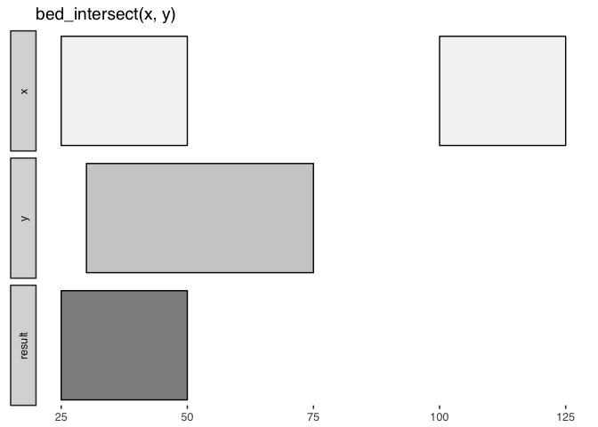

valr 
=====================================================

[](https://travis-ci.org/rnabioco/valr) [](https://ci.appveyor.com/project/jayhesselberth/valr) [](https://codecov.io/github/rnabioco/valr?branch=master) [](https://CRAN.R-project.org/package=valr) [](http://www.r-pkg.org/pkg/valr) [](https://zenodo.org/badge/latestdoi/49370633)

**`valr` provides tools to read and manipulate genome intervals and signals**, similar to the [`BEDtools`](http://bedtools.readthedocs.org/en/latest/) suite. `valr` enables analysis in the R/RStudio environment, leveraging modern R tools in the [`tidyverse`](http://tidyverse.org) for a terse, expressive syntax. Compute-intensive algorithms are implemented in [`Rcpp`](http://www.rcpp.org/)/C++, and many methods take advantage of the speed and grouping capability provided by [`dplyr`](https://github.com/hadley/dplyr).

Installation
------------

The latest stable version can be installed from CRAN:

``` r
install.packages('valr')
```

The latest development version can be installed from github:

``` r
# install.packages("devtools")
devtools::install_github('rnabioco/valr')
```

Why `valr`?
-----------

**Why another tool set for interval manipulations?** Based on our experience teaching genome analysis, we were motivated to develop interval arithmetic software that faciliates genome analysis in a single environment (RStudio), eliminating the need to master both command-line and exploratory analysis tools.

**Note:** `valr` can currently be used for analysis of pre-processed data in BED and related formats. We plan to support BAM and VCF files soon via tabix indexes.

### Familiar tools, natively in R

The functions in `valr` have similar names to their `BEDtools` counterparts, and so will be familiar to users coming from the `BEDtools` suite. Unlike other tools that wrap `BEDtools` and write temporary files to disk, `valr` tools run natively in memory. Similar to [`pybedtools`](https://daler.github.io/pybedtools/#why-pybedtools), `valr` has a terse syntax:

``` r
library(valr)
library(dplyr)

snps <- read_bed(valr_example('hg19.snps147.chr22.bed.gz'), n_fields = 6)
genes <- read_bed(valr_example('genes.hg19.chr22.bed.gz'), n_fields = 6)

# find snps in intergenic regions
intergenic <- bed_subtract(snps, genes)
# find distance from intergenic snps to nearest gene
nearby <- bed_closest(intergenic, genes)

nearby %>%
  select(starts_with('name'), .overlap, .dist) %>%
  filter(abs(.dist) < 5000)
#> # A tibble: 1,047 x 4
#>         name.x   name.y .overlap .dist
#>          <chr>    <chr>    <int> <int>
#>  1 rs530458610    P704P        0  2578
#>  2   rs2261631    P704P        0  -267
#>  3 rs570770556    POTEH        0  -912
#>  4 rs538163832    POTEH        0  -952
#>  5 rs190224195    POTEH        0 -1398
#>  6   rs2379966 DQ571479        0  4749
#>  7 rs142687051 DQ571479        0  3557
#>  8 rs528403095 DQ571479        0  3308
#>  9 rs555126291 DQ571479        0  2744
#> 10   rs5747567 DQ571479        0 -1777
#> # ... with 1,037 more rows
```

### Visual documentation

`valr` includes helpful glyphs to illustrate the results of specific operations, similar to those found in the `BEDtools` documentation. For example, `bed_glyph()` illustrates the result of intersecting `x` and `y` intervals with `bed_intersect()`:

``` r
library(valr)

x <- trbl_interval(
  ~chrom, ~start, ~end,
  'chr1', 25,     50,
  'chr1', 100,    125
)

y <- trbl_interval(
  ~chrom, ~start, ~end,
  'chr1', 30,     75
)

bed_glyph(bed_intersect(x, y))
```



### Reproducible reports

`valr` can be used in RMarkdown documents to generate reproducible work-flows for data processing. Because computations in `valr` are fast, it can be for exploratory analysis with `RMarkdown`, and for interactive analysis using `shiny`.

### Remote databases

Remote databases can be accessed with `db_ucsc()` (to access the UCSC Browser) and `db_ensembl()` (to access Ensembl databases).

``` r
# access the `refGene` tbl on the `hg38` assembly
ucsc <- db_ucsc('hg38')
tbl(ucsc, 'refGene')
```

API
---

Function names are similar to their their [BEDtools](http://bedtools.readthedocs.org/en/latest/) counterparts, with some additions.

### Data types

-   Create new interval sets with `tbl_interval()` and `tbl_genome()`. Coerce existing `GenomicRanges::GRanges` objects with `as.tbl_interval()`.

### Reading data

-   Read BED and related files with `read_bed()`, `read_bed12()`, `read_bedgraph()`, `read_narrowpeak()` and `read_broadpeak()`.

-   Read genome files containing chromosome name and size information with `read_genome()`.

-   Load VCF files with `read_vcf()`.

-   Access remote databases with `db_ucsc()` and `db_ensembl()`.

### Transforming single interval sets

-   Adjust interval coordinates with `bed_slop()` and `bed_shift()`, and create new flanking intervals with `bed_flank()`.

-   Combine nearby intervals with `bed_merge()` and identify nearby intervals with `bed_cluster()`.

-   Generate intervals not covered by a query with `bed_complement()`.

-   Order intervals with `bed_sort()`.

### Comparing multiple interval sets

-   Find overlaps between sets of intervals with `bed_intersect()`.

-   Apply functions to overlapping sets of intervals with `bed_map()`.

-   Remove intervals based on overlaps with `bed_subtract()`.

-   Find overlapping intervals within a window with `bed_window()`.

-   Find closest intervals independent of overlaps with `bed_closest()`.

### Randomizing intervals

-   Generate random intervals with `bed_random()`.

-   Shuffle the coordinates of intervals with `bed_shuffle()`.

-   Sample input intervals with `dplyr::sample_n()` and `dplyr::sample_frac()`.

### Interval statistics

-   Calculate significance of overlaps between sets of intervals with `bed_fisher()` and `bed_projection()`.

-   Quantify relative and absolute distances between sets of intervals with `bed_reldist()` and `bed_absdist()`.

-   Quantify extent of overlap between sets of intervals with `bed_jaccard()`.

### Utilities

-   Create features from BED12 files with `create_introns()`, `create_tss()`, `create_utrs5()`, and `create_utrs3()`.

-   Visualize the actions of valr functions with `bed_glyph()`.

-   Constrain intervals to a genome reference with `bound_intervals()`.

-   Subdivide intervals with `bed_makewindows()`.

-   Convert BED12 to BED6 format with `bed12_to_exons()`.

-   Calculate spacing between intervals with `interval_spacing()`.

Related work
------------

-   Command-line tools [BEDtools](http://bedtools.readthedocs.org/en/latest/) and [bedops](http://bedops.readthedocs.org/en/latest/index.html).

-   The Python library [pybedtools](https://daler.github.io/pybedtools/) wraps BEDtools.

-   The R packages [GenomicRanges](https://bioconductor.org/packages/release/bioc/html/GenomicRanges.html), [bedr](https://CRAN.R-project.org/package=bedr), [IRanges](https://bioconductor.org/packages/release/bioc/html/IRanges.html) and [GenometriCorr](http://journals.plos.org/ploscompbiol/article?id=10.1371/journal.pcbi.1002529) provide similar capability with a different philosophy.
