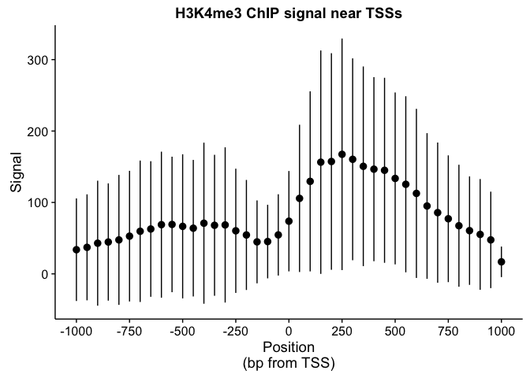

`valr`: Genome interval arithmetic in R
================
Jay Hesselberth <jay.hesselberth@gmail.com>

[](https://travis-ci.com/jayhesselberth/valr) [](https://codecov.io/github/jayhesselberth/valr?branch=master)

`valr` provides methods to do interval manipulations **within the R environment**, enabling fast explorative analysis of genome-scale data.

Installation
============

`valr` can be installed from github:

``` r
> devtools::install_github('jayhesselberth/valr')
```

Overview
========

The goal of `valr` is to enable easy analysis of genome-scale data sets **within R**. Key parts are implemented in `Rcpp` for speed. Moreover, `valr` makes use of new R libraries like `dplyr` and its pipe operator(`%>%`) for an expressive syntax that makes genome analysis fun. So a workflow like [this](https://github.com/arq5x/bedtools-protocols/blob/master/bedtools.md#bp3-plot-transcription-factor-occupancy-surrounding-the-transcription-start-site) becomes:

``` r
library(valr)
library(dplyr)
library(ggplot2)
library(cowplot)

bedfile <- system.file('extdata', 'genes.hg19.chr22.bed.gz', package = 'valr')
bgfile  <- system.file('extdata', 'hela.h3k4.chip.bg.gz', package = 'valr')
genomefile <- system.file('extdata', 'hg19.chrom.sizes.gz', package = 'valr')

genes <- read_bed(bedfile, n_fields = 6)
genome <- read_genome(genomefile)

tss <- genes %>% filter(strand == '+') %>% mutate(end = start + 1)

region_size <- 1000
win_size <- 50

x <- tss %>%
  bed_slop(genome, both = region_size) %>%
  bed_makewindows(genome, win_size = win_size)

y <- read_bedgraph(bgfile)

res <- bed_map(x, y, add_group = 'win_id.x', sums = sum(value.y)) %>%
  group_by(win_id.x) %>%
  summarize(means = mean(sums), sds = sd(sums))

x_labels <- seq(-region_size, region_size, by = win_size * 5)
x_breaks <- seq(1,41, by = 5)
sd_limits <- aes(ymax = means + sds, ymin = means - sds)

ggplot(res, aes(x = win_id.x, y = means)) +
  geom_point()  + geom_pointrange(sd_limits) + 
  scale_x_continuous(labels = x_labels, breaks = x_breaks) + 
  ggtitle('H3K4me3 ChIP signal near TSSs') +
  xlab('Position\n(bp from TSS)') + ylab('Signal')
```



Vignette
========

See the vignettes for a full description of the package and examples (`browseVignettes(package = "valr")`)
