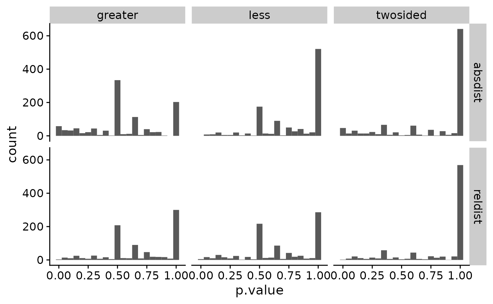
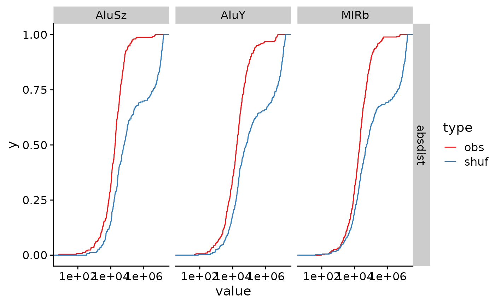

# Interval statistics

## Overview

`valr` includes several functions for exploring statistical
relationships between sets of intervals.

- Calculate significance of overlaps between sets of intervals with
  [`bed_fisher()`](https://rnabioco.github.io/valr/reference/bed_fisher.md)
  and
  [`bed_projection()`](https://rnabioco.github.io/valr/reference/bed_projection.md).

- Quantify relative and absolute distances between sets of intervals
  with
  [`bed_reldist()`](https://rnabioco.github.io/valr/reference/bed_reldist.md)
  and
  [`bed_absdist()`](https://rnabioco.github.io/valr/reference/bed_absdist.md).

- Quantify extent of overlap between sets of intervals with
  [`bed_jaccard()`](https://rnabioco.github.io/valr/reference/bed_jaccard.md).

In this vignette we explore the relationship between transcription start
sites and repetitive elements in the human genome.

``` r
library(valr)
library(dplyr)
library(ggplot2)
library(cowplot)
library(tidyr)

# load repeats and genes. Data in the valr package is restricted to chr22; the entire
# files can be downloaded from UCSC.
rpts <- read_bed(valr_example("hg19.rmsk.chr22.bed.gz"))
genes <- read_bed12(valr_example("hg19.refGene.chr22.bed.gz"))

# load chrom sizes
genome <- read_genome(valr_example("hg19.chrom.sizes.gz"))

# create 1 bp intervals representing transcription start sites
tss <- create_tss(genes)

tss
#> # A tibble: 1,267 × 6
#>    chrom    start      end name         score strand
#>    <chr>    <dbl>    <dbl> <chr>        <chr> <chr> 
#>  1 chr22 16193008 16193009 NR_122113    0     -     
#>  2 chr22 16157078 16157079 NR_133911    0     +     
#>  3 chr22 16162065 16162066 NR_073459    0     +     
#>  4 chr22 16162065 16162066 NR_073460    0     +     
#>  5 chr22 16231288 16231289 NR_132385    0     -     
#>  6 chr22 16287936 16287937 NM_001136213 0     -     
#>  7 chr22 16274608 16274609 NR_046571    0     +     
#>  8 chr22 16449803 16449804 NM_001005239 0     -     
#>  9 chr22 17073699 17073700 NM_014406    0     -     
#> 10 chr22 17082800 17082801 NR_001591    0     +     
#> # ℹ 1,257 more rows
```

## Distance metrics

First we define a function that takes `x` and `y` intervals and computes
distance statistics (using
[`bed_reldist()`](https://rnabioco.github.io/valr/reference/bed_reldist.md)
and
[`bed_absdist()`](https://rnabioco.github.io/valr/reference/bed_absdist.md))
for specified groups. The value of each statistic is assigned to a
`.value` column.

``` r
distance_stats <- function(x, y, genome, group_var, type = NA) {
  group_by(x, !!rlang::sym(group_var)) |>
    do(
      reldist = bed_reldist(., y, detail = TRUE) |>
        select(.value = .reldist),
      absdist = bed_absdist(., y, genome) |>
        select(.value = .absdist)
    ) |>
    tidyr::pivot_longer(
      cols = -name,
      names_to = "stat",
      values_to = "value"
    ) |>
    mutate(type = type)
}
```

We use the `distance_stats()` function to apply the
[`bed_absdist()`](https://rnabioco.github.io/valr/reference/bed_absdist.md)
function to each group of data.

``` r
obs_stats <- distance_stats(rpts, tss, genome, "name", "obs")
obs_stats
#> # A tibble: 2,106 × 4
#>    name       stat    value             type 
#>    <chr>      <chr>   <list>            <chr>
#>  1 (A)n       reldist <tibble [27 × 1]> obs  
#>  2 (A)n       absdist <tibble [28 × 1]> obs  
#>  3 (AAAAACA)n reldist <tibble [1 × 1]>  obs  
#>  4 (AAAAACA)n absdist <tibble [1 × 1]>  obs  
#>  5 (AAAAC)n   reldist <tibble [6 × 1]>  obs  
#>  6 (AAAAC)n   absdist <tibble [7 × 1]>  obs  
#>  7 (AAAAG)n   reldist <tibble [2 × 1]>  obs  
#>  8 (AAAAG)n   absdist <tibble [2 × 1]>  obs  
#>  9 (AAAAT)n   reldist <tibble [3 × 1]>  obs  
#> 10 (AAAAT)n   absdist <tibble [4 × 1]>  obs  
#> # ℹ 2,096 more rows
```

And the same is done for a set of shuffled group of data.
[`bed_shuffle()`](https://rnabioco.github.io/valr/reference/bed_shuffle.md)
is used to shuffle coordinates of the repeats within each chromosome
(i.e., the coordinates change, but the chromosome stays the same.)

``` r
shfs <- bed_shuffle(rpts, genome, within = TRUE)
shf_stats <- distance_stats(shfs, tss, genome, "name", "shuf")
```

Now we can bind the observed and shuffled data together, and do some
tidying to put the data into a format appropriate for a statistical
test. This involves:

1.  [`unnest()`](https://tidyr.tidyverse.org/reference/unnest.html)ing
    the data frames
2.  creating groups for each repeat (`name`), stat (`reldist` or
    `absdist`) and type (`obs` or `shf`)
3.  adding unique surrogate row numbers for each group
4.  using
    [`tidyr::pivot_wider()`](https://tidyr.tidyverse.org/reference/pivot_wider.html)
    to create two new `obs` and `shuf` columns
5.  removing rows with `NA` values.

``` r
res <- bind_rows(obs_stats, shf_stats) |>
  tidyr::unnest(value) |>
  group_by(name, stat, type) |>
  mutate(.id = row_number()) |>
  tidyr::pivot_wider(
    names_from = "type",
    values_from = ".value"
  ) |>
  na.omit()

res
#> # A tibble: 16,804 × 5
#> # Groups:   name, stat [1,923]
#>    name  stat      .id   obs   shuf
#>    <chr> <chr>   <int> <dbl>  <dbl>
#>  1 (A)n  reldist     1 0.363 0.463 
#>  2 (A)n  reldist     2 0.429 0.0588
#>  3 (A)n  reldist     3 0.246 0.177 
#>  4 (A)n  reldist     4 0.478 0.141 
#>  5 (A)n  reldist     5 0.260 0.327 
#>  6 (A)n  reldist     6 0.286 0.286 
#>  7 (A)n  reldist     7 0.498 0.470 
#>  8 (A)n  reldist     8 0.237 0.121 
#>  9 (A)n  reldist     9 0.314 0.260 
#> 10 (A)n  reldist    10 0.149 0.0657
#> # ℹ 16,794 more rows
```

Now that the data are formatted, we can use the non-parametric
[`ks.test()`](https://rdrr.io/r/stats/ks.test.html) to determine whether
there are significant differences between the observed and shuffled data
for each group.
[`broom::tidy()`](https://generics.r-lib.org/reference/tidy.html) is
used to reformat the results of each test into a `tibble`, and the
results of each test are `pivot`ed to into a `type` column for each test
type.

``` r
library(broom)

pvals <- res |>
  do(
    twosided = tidy(ks.test(.$obs, .$shuf)),
    less = tidy(ks.test(.$obs, .$shuf, alternative = "less")),
    greater = tidy(ks.test(.$obs, .$shuf, alternative = "greater"))
  ) |>
  tidyr::pivot_longer(cols = -c(name, stat), names_to = "alt", values_to = "type") |>
  unnest(type) |>
  select(name:p.value) |>
  arrange(p.value)
```

Histgrams of the different stats help visualize the distribution of
p.values.

``` r
ggplot(pvals, aes(p.value)) +
  geom_histogram(binwidth = 0.05) +
  facet_grid(stat ~ alt) +
  theme_cowplot()
```



We can also assess false discovery rates (q.values) using
[`p.adjust()`](https://rdrr.io/r/stats/p.adjust.html).

``` r
pvals <-
  group_by(pvals, stat, alt) |>
  mutate(q.value = p.adjust(p.value)) |>
  ungroup() |>
  arrange(q.value)
```

Finally we can visualize these results using
[`stat_ecdf()`](https://ggplot2.tidyverse.org/reference/stat_ecdf.html).

``` r
res_gather <- tidyr::pivot_longer(res,
  cols = -c(name, stat, .id),
  names_to = "type",
  values_to = "value"
)

signif <- head(pvals, 5)

res_signif <-
  signif |>
  left_join(res_gather, by = c("name", "stat"))
#> Warning in left_join(signif, res_gather, by = c("name", "stat")): Detected an unexpected many-to-many relationship between `x` and `y`.
#> ℹ Row 1 of `x` matches multiple rows in `y`.
#> ℹ Row 29145 of `y` matches multiple rows in `x`.
#> ℹ If a many-to-many relationship is expected, set `relationship =
#>   "many-to-many"` to silence this warning.

ggplot(res_signif, aes(x = value, color = type)) +
  stat_ecdf() +
  facet_grid(stat ~ name) +
  theme_cowplot() +
  scale_x_log10() +
  scale_color_brewer(palette = "Set1")
```



## Projection test

[`bed_projection()`](https://rnabioco.github.io/valr/reference/bed_projection.md)
is a statistical approach to assess the relationship between two
intervals based on the binomial distribution. Here, we examine the
distribution of repetitive elements within the promoters of coding or
non-coding genes.

First we’ll extract 5 kb regions upstream of the transcription start
sites to represent the promoter regions for coding and non-coding genes.

``` r
# create intervals 5kb upstream of tss representing promoters
promoters <-
  bed_flank(genes, genome, left = 5000, strand = TRUE) |>
  mutate(name = ifelse(grepl("NR_", name), "non-coding", "coding")) |>
  select(chrom:strand)

# select coding and non-coding promoters
promoters_coding <- filter(promoters, name == "coding")
promoters_ncoding <- filter(promoters, name == "non-coding")

promoters_coding
#> # A tibble: 973 × 6
#>    chrom    start      end name   score strand
#>    <chr>    <dbl>    <dbl> <chr>  <chr> <chr> 
#>  1 chr22 16287937 16292937 coding 0     -     
#>  2 chr22 16449804 16454804 coding 0     -     
#>  3 chr22 17073700 17078700 coding 0     -     
#>  4 chr22 17302589 17307589 coding 0     -     
#>  5 chr22 17302589 17307589 coding 0     -     
#>  6 chr22 17489112 17494112 coding 0     -     
#>  7 chr22 17560848 17565848 coding 0     +     
#>  8 chr22 17560848 17565848 coding 0     +     
#>  9 chr22 17602213 17607213 coding 0     -     
#> 10 chr22 17602257 17607257 coding 0     -     
#> # ℹ 963 more rows

promoters_ncoding
#> # A tibble: 294 × 6
#>    chrom    start      end name       score strand
#>    <chr>    <dbl>    <dbl> <chr>      <chr> <chr> 
#>  1 chr22 16152078 16157078 non-coding 0     +     
#>  2 chr22 16157065 16162065 non-coding 0     +     
#>  3 chr22 16157065 16162065 non-coding 0     +     
#>  4 chr22 16193009 16198009 non-coding 0     -     
#>  5 chr22 16231289 16236289 non-coding 0     -     
#>  6 chr22 16269608 16274608 non-coding 0     +     
#>  7 chr22 17077800 17082800 non-coding 0     +     
#>  8 chr22 17156430 17161430 non-coding 0     -     
#>  9 chr22 17229328 17234328 non-coding 0     -     
#> 10 chr22 17303363 17308363 non-coding 0     +     
#> # ℹ 284 more rows
```

Next we’ll apply the
[`bed_projection()`](https://rnabioco.github.io/valr/reference/bed_projection.md)
test for each repeat class for both coding and non-coding regions.

``` r
# function to apply bed_projection to groups
projection_stats <- function(x, y, genome, group_var, type = NA) {
  group_by(x, !!rlang::sym(group_var)) |>
    do(
      n_repeats = nrow(.),
      projection = bed_projection(., y, genome)
    ) |>
    mutate(type = type)
}

pvals_coding <- projection_stats(rpts, promoters_coding, genome, "name", "coding")
pvals_ncoding <- projection_stats(rpts, promoters_ncoding, genome, "name", "non_coding")

pvals <-
  bind_rows(pvals_ncoding, pvals_coding) |>
  ungroup() |>
  tidyr::unnest(cols = c(n_repeats, projection)) |>
  select(-chrom)

# filter for repeat classes with at least 10 intervals
pvals <- filter(
  pvals,
  n_repeats > 10,
  obs_exp_ratio != 0
)

# adjust pvalues
pvals <- mutate(pvals, q.value = p.adjust(p.value))

pvals
#> # A tibble: 179 × 7
#>    name   n_repeats p.value obs_exp_ratio lower_tail type       q.value
#>    <chr>      <int>   <dbl>         <dbl> <chr>      <chr>        <dbl>
#>  1 (A)n          28 0.00353         4.72  FALSE      non_coding   0.558
#>  2 (AT)n         48 0.298           0.917 FALSE      non_coding   1    
#>  3 (CA)n         31 0.156           1.42  FALSE      non_coding   1    
#>  4 (GT)n         42 0.247           1.05  FALSE      non_coding   1    
#>  5 (T)n          61 0.405           0.721 FALSE      non_coding   1    
#>  6 (TG)n         40 0.0622          2.20  FALSE      non_coding   1    
#>  7 A-rich        54 0.348           0.815 FALSE      non_coding   1    
#>  8 Alu           15 0.0446          2.93  FALSE      non_coding   1    
#>  9 AluJb        271 0.0225          1.79  FALSE      non_coding   1    
#> 10 AluJo        208 0.0216          1.90  FALSE      non_coding   1    
#> # ℹ 169 more rows
```

The projection test is a two-tailed statistical test. A significant
p-value indicates either enrichment or depletion of query intervals
compared to the reference interval sets. A value of `lower_tail = TRUE`
column indicates that the query intervals are depleted, whereas
`lower_tail = FALSE` indicates that the query intervals are enriched.

``` r
library(DT)

# find and show top 5 most significant repeats
signif_tests <-
  pvals |>
  arrange(q.value) |>
  group_by(type) |>
  top_n(-5, q.value) |>
  arrange(type)

DT::datatable(signif_tests)
```
