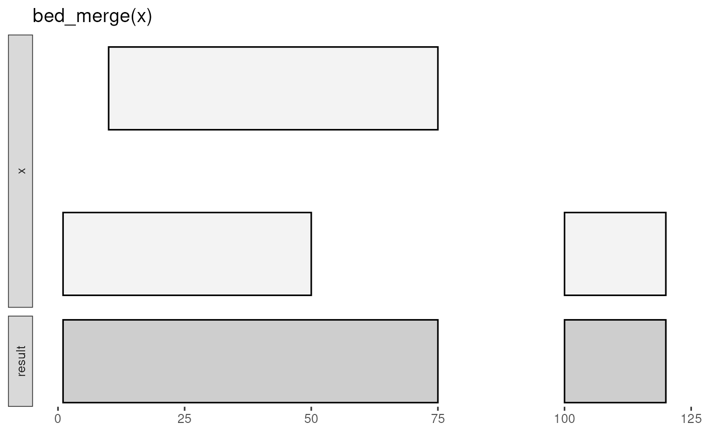

# valr overview

### Familiar tools, natively in R

The functions in `valr` have similar names to their `BEDtools`
counterparts, and so will be familiar to users coming from the
`BEDtools` suite. Similar to
[`pybedtools`](https://daler.github.io/pybedtools/#why-pybedtools),
`valr` has a terse syntax:

``` r
library(valr)
library(dplyr)

snps <- read_bed(valr_example("hg19.snps147.chr22.bed.gz"))
genes <- read_bed(valr_example("genes.hg19.chr22.bed.gz"))

# find snps in intergenic regions
intergenic <- bed_subtract(snps, genes)
#> Warning: The `min_overlap` argument of `bed_subtract()` is deprecated as of valr 0.8.0.
#> ℹ The default will change from 0 (book-ended intervals overlap) to 1 (strict
#>   overlap) in a future version.
#> ℹ Set `min_overlap = 0L` to keep the legacy behavior, or `min_overlap = 1L` for
#>   bedtools-compatible behavior.
#> This warning is displayed once every 8 hours.
#> Call `lifecycle::last_lifecycle_warnings()` to see where this warning was
#> generated.
# distance from intergenic snps to nearest gene
nearby <- bed_closest(intergenic, genes)

nearby |>
  select(starts_with("name"), .overlap, .dist) |>
  filter(abs(.dist) < 1000)
#> # A tibble: 285 × 4
#>    name.x      name.y            .overlap .dist
#>    <chr>       <chr>                <int> <int>
#>  1 rs2261631   P704P                    0  -268
#>  2 rs570770556 POTEH                    0  -913
#>  3 rs538163832 POTEH                    0  -953
#>  4 rs9606135   TPTEP1                   0  -422
#>  5 rs11912392  ANKRD62P1-PARP4P3        0   105
#>  6 rs8136454   BC038197                 0   356
#>  7 rs5992556   XKR3                     0  -456
#>  8 rs114101676 GAB4                     0   474
#>  9 rs62236167  CECR7                    0   262
#> 10 rs5747023   CECR1                    0  -387
#> # ℹ 275 more rows
```

### Input data

`valr` assigns common column names to facilitate comparisons between
tbls. All tbls will have `chrom`, `start`, and `end` columns, and some
tbls from multi-column formats will have additional pre-determined
column names. See the
[`read_bed()`](https://rnabioco.github.io/valr/dev/reference/read_bed.md)
documentation for details.

``` r
bed_file <- valr_example("3fields.bed.gz")
read_bed(bed_file) # accepts filepaths or URLs
#> # A tibble: 10 × 3
#>    chrom  start    end
#>    <chr>  <dbl>  <dbl>
#>  1 chr1   11873  14409
#>  2 chr1   14361  19759
#>  3 chr1   14406  29370
#>  4 chr1   34610  36081
#>  5 chr1   69090  70008
#>  6 chr1  134772 140566
#>  7 chr1  321083 321115
#>  8 chr1  321145 321207
#>  9 chr1  322036 326938
#> 10 chr1  327545 328439
```

`valr` can also operate on BED-like data.frames already constructed in
R, provided that columns named `chrom`, `start` and `end` are present.
New tbls can also be constructed as either `tibbles` or base R
`data.frames`.

``` r
bed <- tribble(
  ~chrom , ~start  , ~end    ,
  "chr1" , 1657492 , 2657492 ,
  "chr2" , 2501324 , 3094650
)

bed
#> # A tibble: 2 × 3
#>   chrom   start     end
#>   <chr>   <dbl>   <dbl>
#> 1 chr1  1657492 2657492
#> 2 chr2  2501324 3094650
```

### Interval coordinates

`valr` adheres to the BED
[format](https://genome.ucsc.edu/FAQ/FAQformat#format1) which specifies
that the start position for an interval is zero based and the end
position is one-based. The first position in a chromosome is 0. The end
position for a chromosome is one position passed the last base, and is
not included in the interval. For example:

``` r
# a chromosome 100 basepairs in length
chrom <- tribble(
  ~chrom , ~start , ~end ,
  "chr1" ,      0 ,  100
)

chrom
#> # A tibble: 1 × 3
#>   chrom start   end
#>   <chr> <dbl> <dbl>
#> 1 chr1      0   100

# single base-pair intervals
bases <- tribble(
  ~chrom , ~start , ~end ,
  "chr1" ,      0 ,    1 , # first base of chromosome
  "chr1" ,      1 ,    2 , # second base of chromosome
  "chr1" ,     99 ,  100 # last base of chromosome
)

bases
#> # A tibble: 3 × 3
#>   chrom start   end
#>   <chr> <dbl> <dbl>
#> 1 chr1      0     1
#> 2 chr1      1     2
#> 3 chr1     99   100
```

### Remote databases

Remote databases can be accessed with
[`db_ucsc()`](https://rnabioco.github.io/valr/dev/reference/db.md) (to
access the UCSC Browser) and
[`db_ensembl()`](https://rnabioco.github.io/valr/dev/reference/db.md)
(to access Ensembl databases).

``` r
# access the `refGene` tbl on the `hg38` assembly.
if (require(RMariaDB)) {
  ucsc <- db_ucsc("hg38")
  tbl(ucsc, "refGene")
}
```

### Visual documentation

The
[`bed_glyph()`](https://rnabioco.github.io/valr/dev/reference/bed_glyph.md)
tool illustrates the results of operations in `valr`, similar to those
found in the `BEDtools` documentation. This glyph shows the result of
intersecting `x` and `y` intervals with
[`bed_intersect()`](https://rnabioco.github.io/valr/dev/reference/bed_intersect.md):

``` r
x <- tribble(
  ~chrom , ~start , ~end ,
  "chr1" ,     25 ,   50 ,
  "chr1" ,    100 ,  125
)

y <- tribble(
  ~chrom , ~start , ~end ,
  "chr1" ,     30 ,   75
)

bed_glyph(bed_intersect(x, y))
#> Warning: The `min_overlap` argument of `bed_intersect()` is deprecated as of valr 0.8.0.
#> ℹ The default will change from 0 (book-ended intervals overlap) to 1 (strict
#>   overlap) in a future version.
#> ℹ Set `min_overlap = 0L` to keep the legacy behavior, or `min_overlap = 1L` for
#>   bedtools-compatible behavior.
#> This warning is displayed once every 8 hours.
#> Call `lifecycle::last_lifecycle_warnings()` to see where this warning was
#> generated.
```


And this glyph illustrates
[`bed_merge()`](https://rnabioco.github.io/valr/dev/reference/bed_merge.md):

``` r
x <- tribble(
  ~chrom , ~start , ~end ,
  "chr1" ,      1 ,   50 ,
  "chr1" ,     10 ,   75 ,
  "chr1" ,    100 ,  120
)

bed_glyph(bed_merge(x))
```



### Grouping data

The `group_by` function in dplyr can be used to perform functions on
subsets of single and multiple `data_frame`s. Functions in `valr`
leverage grouping to enable a variety of comparisons. For example,
intervals can be grouped by `strand` to perform comparisons among
intervals on the same strand.

``` r
x <- tribble(
  ~chrom , ~start , ~end , ~strand ,
  "chr1" ,      1 ,  100 , "+"     ,
  "chr1" ,     50 ,  150 , "+"     ,
  "chr2" ,    100 ,  200 , "-"
)

y <- tribble(
  ~chrom , ~start , ~end , ~strand ,
  "chr1" ,     50 ,  125 , "+"     ,
  "chr1" ,     50 ,  150 , "-"     ,
  "chr2" ,     50 ,  150 , "+"
)

# intersect tbls by strand
x <- group_by(x, strand)
y <- group_by(y, strand)

bed_intersect(x, y)
#> # A tibble: 2 × 8
#>   chrom start.x end.x strand.x start.y end.y strand.y .overlap
#>   <chr>   <dbl> <dbl> <chr>      <dbl> <dbl> <chr>       <int>
#> 1 chr1        1   100 +             50   125 +              50
#> 2 chr1       50   150 +             50   125 +              75
```

Comparisons between intervals on opposite strands are done using the
[`flip_strands()`](https://rnabioco.github.io/valr/dev/reference/flip_strands.md)
function:

``` r
x <- group_by(x, strand)

y <- flip_strands(y)
y <- group_by(y, strand)

bed_intersect(x, y)
#> # A tibble: 3 × 8
#>   chrom start.x end.x strand.x start.y end.y strand.y .overlap
#>   <chr>   <dbl> <dbl> <chr>      <dbl> <dbl> <chr>       <int>
#> 1 chr1        1   100 +             50   150 +              50
#> 2 chr1       50   150 +             50   150 +             100
#> 3 chr2      100   200 -             50   150 -              50
```

Both single set
(e.g. [`bed_merge()`](https://rnabioco.github.io/valr/dev/reference/bed_merge.md))
and multi set operations will respect groupings in the input intervals.

### Column specification

Columns in `BEDtools` are referred to by position:

``` bash
# calculate the mean of column 6 for intervals in `b` that overlap with `a`
bedtools map -a a.bed -b b.bed -c 6 -o mean
```

In `valr`, columns are referred to by name and can be used in multiple
name/value expressions for summaries.

``` r
# calculate the mean and variance for a `value` column
bed_map(a, b, .mean = mean(value), .var = var(value))

# report concatenated and max values for merged intervals
bed_merge(a, .concat = concat(value), .max = max(value))
```

## Getting started

### Meta-analysis

This demonstration illustrates how to use `valr` tools to perform a
“meta-analysis” of signals relative to genomic features. Here we to
analyze the distribution of histone marks surrounding transcription
start sites.

First we load libraries and relevant data.

``` r
# `valr_example()` identifies the path of example files
bedfile <- valr_example("genes.hg19.chr22.bed.gz")
genomefile <- valr_example("hg19.chrom.sizes.gz")
bgfile <- valr_example("hela.h3k4.chip.bg.gz")

genes <- read_bed(bedfile)
genome <- read_genome(genomefile)
y <- read_bedgraph(bgfile)
```

Then we generate 1 bp intervals to represent transcription start sites
(TSSs). We focus on `+` strand genes, but `-` genes are easily
accommodated by filtering them and using
[`bed_makewindows()`](https://rnabioco.github.io/valr/dev/reference/bed_makewindows.md)
with `reversed` window numbers.

``` r
# generate 1 bp TSS intervals, `+` strand only
tss <- genes |>
  filter(strand == "+") |>
  mutate(end = start + 1)

# 1000 bp up and downstream
region_size <- 1000
# 50 bp windows
win_size <- 50

# add slop to the TSS, break into windows and add a group
x <- tss |>
  bed_slop(genome, both = region_size) |>
  bed_makewindows(win_size)

x
#> # A tibble: 13,530 × 7
#>    chrom    start      end name      score strand .win_id
#>    <chr>    <dbl>    <dbl> <chr>     <chr> <chr>    <int>
#>  1 chr22 16161065 16161115 LINC00516 3     +            1
#>  2 chr22 16161115 16161165 LINC00516 3     +            2
#>  3 chr22 16161165 16161215 LINC00516 3     +            3
#>  4 chr22 16161215 16161265 LINC00516 3     +            4
#>  5 chr22 16161265 16161315 LINC00516 3     +            5
#>  6 chr22 16161315 16161365 LINC00516 3     +            6
#>  7 chr22 16161365 16161415 LINC00516 3     +            7
#>  8 chr22 16161415 16161465 LINC00516 3     +            8
#>  9 chr22 16161465 16161515 LINC00516 3     +            9
#> 10 chr22 16161515 16161565 LINC00516 3     +           10
#> # ℹ 13,520 more rows
```

Now we use the `.win_id` group with
[`bed_map()`](https://rnabioco.github.io/valr/dev/reference/bed_map.md)
to calculate a sum by mapping `y` signals onto the intervals in `x`.
These data are regrouped by `.win_id` and a summary with `mean` and `sd`
values is calculated.

``` r
# map signals to TSS regions and calculate summary statistics.
res <- bed_map(x, y, win_sum = sum(value, na.rm = TRUE)) |>
  group_by(.win_id) |>
  summarize(
    win_mean = mean(win_sum, na.rm = TRUE),
    win_sd = sd(win_sum, na.rm = TRUE)
  )

res
#> # A tibble: 41 × 3
#>    .win_id win_mean win_sd
#>      <int>    <dbl>  <dbl>
#>  1       1     101.   85.8
#>  2       2     111.   81.1
#>  3       3     123.   99.1
#>  4       4     116.   96.3
#>  5       5     116.  102. 
#>  6       6     125.   95.1
#>  7       7     123.   94.4
#>  8       8     128.   91.5
#>  9       9     130.   95.7
#> 10      10     130.   88.8
#> # ℹ 31 more rows
```

Finally, these summary statistics are used to construct a plot that
illustrates histone density surrounding TSSs.

``` r
x_labels <- seq(
  -region_size,
  region_size,
  by = win_size * 5
)

x_breaks <- seq(1, 41, by = 5)

sd_limits <- aes(
  ymax = win_mean + win_sd,
  ymin = win_mean - win_sd
)

ggplot(
  res,
  aes(
    x = .win_id,
    y = win_mean
  )
) +
  geom_point() +
  geom_pointrange(sd_limits) +
  scale_x_continuous(
    labels = x_labels,
    breaks = x_breaks
  ) +
  labs(
    x = "Position (bp from TSS)",
    y = "Signal",
    title = "Human H3K4me3 signal near transcription start sites"
  ) +
  theme_classic()
```


## Related work

- Command-line tools
  [BEDtools](https://bedtools.readthedocs.io/en/latest/) and
  [bedops](https://bedops.readthedocs.io/en/latest/index.html).

- The Python library [pybedtools](https://pythonhosted.org/pybedtools/)
  wraps BEDtools.

- The R packages
  [GenomicRanges](https://bioconductor.org/packages/release/bioc/html/GenomicRanges.html),
  [bedr](https://CRAN.R-project.org/package=bedr),
  [IRanges](https://bioconductor.org/packages/release/bioc/html/IRanges.html)
  and
  [GenometriCorr](https://journals.plos.org/ploscompbiol/article?id=10.1371/journal.pcbi.1002529)
  provide similar capability with a different philosophy.
